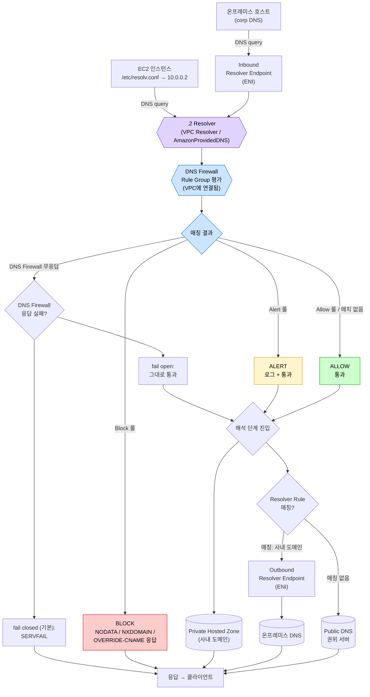

# AWS Route 53 Resolver DNS Firewall 통합 정리

> 출처: AWS 공식 문서 (resolver-dns-firewall, firewall-advanced, vpc-configuration, managed-domain-lists, route53 quotas, prescriptive guidance — centralized egress)

---

## 1. AWS DNS Firewall이란 무엇인가

**Amazon Route 53 Resolver DNS Firewall**은 **VPC에서 발생하는 아웃바운드 DNS 쿼리를 도메인 이름 기준으로 필터링**하는 보안 기능이다. Route 53 VPC Resolver의 한 기능으로, 별도의 Resolver 설정 없이 룰 그룹을 VPC에 연결하기만 하면 동작한다.

- **위치**: VPC Resolver 경로 위 — 모든 DNS 쿼리는 VPC Resolver를 거쳐가며, DNS Firewall은 그 길목에서 동작
- **단위**: 리전(Region) 단위 서비스 — 룰 그룹은 리전마다 별도 생성 필요
- **필터링 대상**: 도메인 **이름** 기반(IP 기반 아님). HTTP/TLS/SSH 등 응용 계층 트래픽은 보지 않음
- **주요 가치**:
  - **DNS exfiltration 차단** (악성 도메인으로의 DNS 터널링/유출)
  - **악성/봇넷/멀웨어 도메인 차단** (AWS Managed Domain List 활용)
  - **Allowlist 강제** (사내 정책상 허용된 도메인 외 모두 차단)
  - **PHZ(Private Hosted Zone) / EC2 인스턴스 이름 / VPC Endpoint 이름 해석도 차단 가능**

> **DNS Firewall vs Network Firewall**
> 둘 다 도메인 기반 필터링을 제공하지만 경로가 다르다. DNS Firewall은 **VPC Resolver를 거치는 DNS 쿼리만** 본다. Network Firewall은 **L3/L7 트래픽 자체**를 보지만 VPC Resolver의 DNS 쿼리는 보지 못한다. 두 서비스를 **함께** 운영하는 것이 권장 패턴.

---

## 2. 도입 효과

| 효과 | 설명 |
|------|------|
| **데이터 유출 차단** | DNS 터널링/DGA 등 DNS 기반 데이터 exfiltration 차단 |
| **위협 인텔리전스 자동 적용** | AWS Managed Domain List가 멀웨어/봇넷/GuardDuty 위협 도메인을 자동 갱신 |
| **고급 위협 탐지** | Resolver DNS Firewall Advanced로 DGA, Dictionary DGA, DNS 터널링 패턴 분석 |
| **Allowlist 모델 운영** | 명시적으로 허용한 도메인 외 모두 차단(walled garden) |
| **하이브리드 가시성 통합** | VPC 발 쿼리 + 온프레미스 → Inbound endpoint 경유 쿼리 모두 필터링 |
| **중앙 관리** | AWS Firewall Manager + Route 53 Profile로 멀티 계정/멀티 VPC 일괄 적용 |
| **GuardDuty 연계** | GuardDuty DNS findings → DNS Firewall 자동 차단 자동화 가능 |
| **Custom Block 응답** | NODATA / NXDOMAIN / CNAME 오버라이드(싱크홀)로 응답 제어 |

---

## 3. 핵심 구성 요소

```
[VPC] → DNS query → [Route 53 VPC Resolver]
                          │
                          ▼
                  [DNS Firewall]
                          │
        ┌─────────────────┼─────────────────┐
        ▼                 ▼                 ▼
  [Rule Group 1]    [Rule Group 2]    [Rule Group N]
   (priority 100)   (priority 200)    (priority 300)
        │
   ┌────┼────┐
   ▼    ▼    ▼
  Rule Rule Rule  ← 각 Rule = (Domain List | Advanced) + Action
```

### 3.1 Rule Group (룰 그룹)
- **DNS Firewall Rule들의 명명된 컬렉션** — 재사용 가능
- VPC에 연결될 때 **priority(우선순위)** 부여 — 낮은 숫자부터 평가
- 한 VPC에 **최대 5개** 룰 그룹 연결 가능 (조정 불가)
- 리전당 룰 그룹 1,000개 (조정 가능)

### 3.2 Rule (룰)
- **하나의 도메인 리스트 또는 Advanced 보호 + Action** 구성
- 룰 그룹 내에서 priority 순서로 평가(첫 매치 시 종료)
- 룰 그룹 1개당 룰 **최대 100개** (조정 가능)

### 3.3 Domain List (도메인 리스트)
| 종류 | 설명 |
|------|------|
| **Managed Domain List** | AWS가 관리/갱신. 내용 조회·다운로드 불가(IP 보호) |
| **Custom Domain List** | 사용자가 직접 관리(콘솔 입력 또는 S3 import) |

**Managed Domain List 종류:**
| 이름 | 용도 |
|------|------|
| `AWSManagedDomainsMalwareDomainList` | 멀웨어 배포/호스팅 도메인 |
| `AWSManagedDomainsBotnetCommandandControl` | 봇넷 C&C 도메인 |
| `AWSManagedDomainsAggregateThreatList` | 위 모두 + 랜섬웨어/스파이웨어/DNS 터널링 (**상위 집합**) |
| `AWSManagedDomainsAmazonGuardDutyThreatList` | GuardDuty 내부 위협 인텔리전스 기반 |

> **테스트용 도메인** (해당 리스트에 매칭됨)
> `controldomain1.malwarelist.firewall.route53resolver.us-east-1.amazonaws.com` 등으로 차단 동작 검증 가능 — 차단되지 않으면 1.2.3.4로 응답.

### 3.4 Action (동작)
| Action | 설명 |
|--------|------|
| **Allow** | 검사 종료, 통과. (Advanced 룰에서는 사용 불가) |
| **Alert** | 검사 종료, 통과 + Resolver query log에 알림 기록 |
| **Block** | 차단 + 로그. 응답 형태 선택 가능 |

**Block 응답 종류:**
| 응답 | 의미 |
|------|------|
| `NODATA` | 쿼리는 성공이지만 응답 없음 (기본값으로 적합) |
| `NXDOMAIN` | 도메인 없음 — 클라이언트가 빠르게 재시도 안 함 |
| `OVERRIDE` (CNAME) | 싱크홀(예: 사내 차단 안내 페이지 CNAME)로 리다이렉트, TTL 설정 가능 |

### 3.5 Advanced Protection (DNS Firewall Advanced)
도메인 리스트 없이 **DNS 페이로드의 패턴 분석**으로 위협 탐지.

| 보호 유형 | 탐지 대상 |
|-----------|----------|
| **DGA (Domain Generation Algorithm)** | 무작위 생성 도메인을 활용한 멀웨어 통신 |
| **Dictionary DGA** | 사전 단어 조합 기반 DGA(C&C 통신 회피용) |
| **DNS Tunneling** | DNS 쿼리/응답에 데이터를 인코딩한 데이터 유출/통신 채널 |

- 탐지 신호: 쿼리 문자열, 길이/엔트로피, 빈도, 타임스탬프 등
- **Confidence Threshold** 설정 필수: `LOW` (탐지율↑/오탐↑) / `MEDIUM` / `HIGH` (오탐↓)
- Action은 **Block 또는 Alert만** 가능 (Allow 없음)
- 오탐은 **더 낮은 priority 룰**로 명시적 Allow 추가하여 회피

### 3.6 Domain Redirection 설정 (CNAME/DNAME 체인)
- 기본값: **체인 전체 검사** — CNAME/DNAME 단계마다 도메인 매칭
- "첫 도메인만 신뢰"로 변경 가능하지만 보안상 비권장
- 체인 전체 검사를 사용하면 **타깃 도메인도 Allow 도메인 리스트에 추가**해야 함

### 3.7 Query Type 필터
- 특정 DNS 레코드 타입만 차단/허용 가능 (예: 도메인 X의 모든 쿼리는 차단하되 MX는 허용)

### 3.8 VPC Association (VPC 연결)
- 룰 그룹을 VPC에 연결하면 그 VPC의 VPC Resolver가 DNS Firewall로 쿼리를 보내기 시작
- 여러 룰 그룹 연결 시 **priority 순서**로 평가
- VPC 1개당 룰 그룹 **최대 5개** (조정 불가)

### 3.9 VPC Fail Mode (장애 시 동작) — **중요 보안 결정**
DNS Firewall이 응답을 못 주는 장애 상황에서 VPC Resolver의 동작.

| 모드 | 동작 | 트레이드오프 |
|------|------|------------|
| **Fail Closed (기본값)** | 모든 쿼리 차단(`SERVFAIL`) | 보안 우선 — 가용성 영향 가능 |
| **Fail Open** | 쿼리 통과 | 가용성 우선 — 장애 시 필터링 우회 |

> 운영 환경 권장: **민감 워크로드는 fail closed 유지**, 가용성이 절대적인 워크로드는 별도 VPC로 분리 후 fail open.

---

## 4. 트래픽 처리 흐름 (하이브리드 시나리오 핵심)



**다이어그램 핵심 포인트:**

| 위치 | 의미 |
|------|------|
| `.2 Resolver` 진입 시점 | EC2와 Inbound Endpoint 양쪽에서 들어온 쿼리가 **모두 같은 지점**에서 합류 |
| DNS Firewall이 **PHZ/Resolver Rule보다 앞** | 사내 도메인·온프레미스 도메인도 차단될 수 있음 → Allow 등록 필수 |
| Match 결과의 4가지 분기 | `Block` / `Alert` / `Allow(or no match)` / `Firewall 무응답` |
| Fail mode 분기 | `fail closed`(기본, SERVFAIL) vs `fail open`(통과) — VPC 단위 설정 |
| `Outbound Endpoint` 도달 조건 | DNS Firewall 통과 + Resolver Rule 매칭, **두 단계를 모두 거침** |

---

DNS Firewall은 **VPC Resolver를 통과하는 쿼리만** 본다. 즉:

| 쿼리 경로 | DNS Firewall 적용 여부 |
|-----------|---------------------|
| VPC EC2 → VPC Resolver → 인터넷 권위 서버 | ✅ 적용 |
| VPC EC2 → VPC Resolver → **PHZ** 조회 | ✅ 적용 (사내 도메인도 차단 가능 — 주의!) |
| VPC EC2 → VPC Resolver → **Outbound endpoint → 온프레미스 DNS** | ✅ 적용 (포워딩 룰 평가 **이전** 단계에서 필터링) |
| 온프레미스 → **Inbound endpoint** → VPC Resolver | ✅ 적용 (해당 VPC의 룰 그룹이 적용됨) |
| 온프레미스 호스트 → 온프레미스 DNS (AWS 미경유) | ❌ 적용 안 됨 |
| EC2가 `/etc/resolv.conf`에 8.8.8.8 등 외부 DNS 직접 설정 | ❌ VPC Resolver 미경유 → 적용 안 됨 (별도 차단 필요) |

> **하이브리드 환경에서의 함정 — Outbound forwarding 평가 순서**
> 사내 도메인을 위한 forwarding rule보다 DNS Firewall이 **먼저** 동작한다. 즉 사내 도메인도 차단 룰에 걸리면 온프레미스 DNS로 전달되지 않는다. → **사내/온프레미스 도메인은 명시적으로 Allow 리스트에 추가** 필요.

---

## 5. 평가 순서

```
1. VPC Resolver가 쿼리 수신
2. DNS Firewall로 전달
3. 연결된 Rule Group들을 priority 오름차순으로 평가
   3-1. 각 Rule Group 내 Rule들을 priority 오름차순으로 평가
   3-2. Rule의 Domain List/Advanced 보호와 매칭 시 → Action 적용 후 종료
4. 모두 매칭 안 되면 → 정상 해석 진행 (Forwarding rule, PHZ, public DNS)
5. DNS Firewall 무응답 시 → VPC Fail Mode(open/closed) 적용
```

**핵심**: 첫 매치(first match)가 승. 따라서 **Allow 룰을 Block 룰보다 낮은 priority**로 두면 화이트리스트 우회 가능.

---

## 6. 제약 사항 (Quotas / 기능적 한계)

### 6.1 주요 쿼터

| 항목 | 기본값 | 조정 가능 |
|------|--------|-----------|
| VPC당 Rule Group 연결 수 | **5** | ❌ 불가 |
| Rule Group당 Rule 수 | 100 | ✅ |
| 리전당 Rule Group 수 | 1,000 | ✅ |
| 계정당 Domain List 수 | 1,000 | ✅ |
| 계정당 Domain 총 수 | 100,000 | ✅ |
| S3 import 파일 1개당 도메인 수 | 250,000 | ✅ |
| Route 53 Profile당 Rule Group 연결 수 | 5 | ❌ 불가 |

### 6.2 기능적 제약
- **리전 단위 서비스**: 멀티 리전 운영 시 룰 그룹을 **각 리전에 따로 생성**해야 함 (RAM 공유 불가능, Profile로 일부 우회 가능)
- **도메인 이름만 필터링**: IP 기반 차단 불가 (악성 IP는 Network Firewall이나 SG/NACL로 처리)
- **응용 계층 미가시**: HTTPS·SNI·SSH·FTP 등 트래픽 본문은 보지 않음
- **Managed Domain List 내용 조회 불가**: 어떤 도메인이 들어 있는지 확인 불가 → 오탐 발생 시 Resolver query log로 확인하여 Allow 룰 추가 필요
- **VPC Resolver 미경유 쿼리는 보호 불가**: EC2가 외부 DNS 서버를 직접 사용하면 우회됨
- **Advanced 룰의 Action**: Block / Alert만 가능 (Allow 없음 → 오탐 회피는 별도 Allow 룰을 더 낮은 priority로)
- **VPC당 Rule Group 5개 한도**: 멀티 팀 환경에서 룰 그룹 분리 정책 사전 설계 필요

### 6.3 가시성 제약
- DNS Firewall 자체 로그는 없음 — **Route 53 Resolver Query Logs**(`firewall_rule_group_id`, `firewall_rule_action`, `firewall_domain_list_id` 필드)에서 확인
- CloudWatch 메트릭으로 차단 수 카운트 가능
- EventBridge로 이벤트 라우팅 가능 (Lambda 자동화 등)

---

## 7. 운영 중 환경에 도입 전 고려 사항 (가장 중요)

### 7.1 인벤토리 사전 확인
운영 환경에 적용하기 **전에** 다음을 모두 파악해야 한다.

- [ ] **현재 VPC Resolver를 거치는 모든 도메인 패턴**
  - 사전에 **Resolver Query Logging을 활성화하고 최소 1~2주 수집** → 도메인 사용 패턴 분석
  - 누락하면 도메인이 차단되어 운영 장애 발생
- [ ] **사내 / 온프레미스 도메인 목록** (forwarding rule 대상)
  - DNS Firewall은 forwarding rule **이전**에 동작 → Allow 등록 안 하면 사내 도메인도 막힘
- [ ] **Private Hosted Zone에 등록된 모든 도메인**
  - PHZ 도메인도 DNS Firewall 대상이므로 Allow 명시 필요
- [ ] **AWS 서비스 엔드포인트 도메인** (`*.amazonaws.com`, `*.aws.dev` 등)
  - SDK/CLI/리전 서비스 호출이 막히면 광범위 장애
- [ ] **SaaS / 외부 API 도메인** (모니터링, CI/CD, 서드파티)
- [ ] **EC2가 VPC Resolver를 사용하는지** 확인 (`/etc/resolv.conf`)
  - 외부 DNS를 직접 쓰는 인스턴스는 DNS Firewall로 보호 불가

### 7.2 단계적 롤아웃 (반드시 권장)

```
1단계: 비프로덕션 VPC 1개에 Alert 모드로 Managed List 적용
       → CloudWatch + Resolver Query Logs로 1~2주 관찰
2단계: 오탐 도메인을 Allow 리스트로 Whitelist
3단계: 비프로덕션 → Block 모드 전환 (NODATA로 시작)
4단계: 프로덕션 1개 VPC에 Alert 모드 적용 → 검증
5단계: 프로덕션 Block 전환 → 관찰
6단계: Custom Block List + Advanced Protection 추가
7단계: AWS Firewall Manager / Route 53 Profile로 전사 확장
```

> **핵심 원칙**: "**Start in logging-only mode, change to block mode after you've validated that legitimate traffic isn't affected**" — AWS Prescriptive Guidance

### 7.3 룰 그룹 설계 전략

**Allow-list (walled garden)** 와 **Deny-list (블랙리스트)** 의 혼합 패턴 권장:

| 우선순위 | 룰 그룹 | 내용 |
|----------|--------|------|
| 100 | `corp-allow` | 사내·온프레미스·AWS 서비스·필수 SaaS 도메인 → **Allow** |
| 200 | `aws-managed-block` | `AWSManagedDomainsAggregateThreatList` → **Block (NODATA)** |
| 300 | `custom-block` | 사내 정책상 차단 도메인 (TLD `.xyz`, `.top` 등) → **Block** |
| 400 | `advanced-protection` | DGA / DNS Tunneling → **Alert** (운영 안정 후 Block 전환) |
| 500 (선택) | `default-deny` | `*.` (모든 것) → **Block** (완전 walled garden일 때만) |

### 7.4 하이브리드 환경 전용 체크리스트

- [ ] **Outbound Resolver Endpoint + Forwarding Rule이 등록한 모든 도메인을 Allow 리스트에 추가**
- [ ] **Inbound Resolver Endpoint를 통해 들어오는 온프레미스 쿼리도 DNS Firewall에 걸림** — 온프레미스 사용자가 자주 조회하는 AWS 도메인을 Allow에 추가
- [ ] **AD 도메인** (`*.corp.local` 등) Allow 등록
- [ ] **CNAME 체인 검사** 활성화 시 → AWS 서비스가 사용하는 CNAME 타깃(예: ELB의 `*.elb.amazonaws.com`, CloudFront `*.cloudfront.net`, S3 `*.s3.amazonaws.com`) Allow에 추가
- [ ] **온프레미스 DNS 서버 자체의 도메인**(NS 레코드 응답)도 PHZ에 있으면 Allow

### 7.5 Fail Mode 결정
- 기본값(fail closed)은 **보안 우선** — DNS Firewall 장애 시 모든 쿼리 SERVFAIL
- 가용성이 더 중요한 워크로드(예: 결제, 외부 고객 서비스)는 별도 VPC로 분리 후 **fail open** 검토

### 7.6 멀티 계정/멀티 VPC 운영
- **AWS Firewall Manager**: Organizations 전체에 룰 그룹 자동 적용 (특정 OU/계정 스코핑 가능)
- **Route 53 Profile**: 룰 그룹 + Forwarding Rule + PHZ 연결을 **하나의 패키지**로 묶어 RAM 공유 — 하이브리드 멀티 계정에서 매우 유용
- **AWS RAM**: 룰 그룹을 다른 계정과 공유하여 일관 적용

### 7.7 GuardDuty 연계 자동화
- GuardDuty의 DNS findings를 EventBridge → Lambda → DNS Firewall Custom Domain List 자동 추가 패턴
- 또는 `AWSManagedDomainsAmazonGuardDutyThreatList` 사용 (운영 단순)

### 7.8 모니터링/감사
- **Resolver Query Logs**: CloudWatch Logs / S3 / Kinesis Firehose로 출력
- **CloudWatch Metrics**: `Route 53 Resolver` 네임스페이스 → 룰 그룹별 Block/Alert/Allow 카운트
- **EventBridge**: 차단 이벤트로 알림/자동화 트리거
- **AWS Config**: 룰 그룹 변경 감사

### 7.9 비용 고려
- DNS Firewall은 **처리한 DNS 쿼리 수(per million queries)** 단위 과금
- Managed Domain List는 **추가 요금 없음**(대신 List 사용 시 카운트되는 쿼리에 일반 단가 적용)
- DNS Firewall Advanced는 **별도 단가**(DGA/터널링 분석 비용)
- 활성화 전 Resolver query 볼륨을 CloudWatch로 측정해 비용 시뮬레이션 권장

### 7.10 도입 체크리스트 (요약)

- [ ] Resolver Query Logging을 1~2주 선행 수집
- [ ] PHZ / 온프레미스 / AWS 서비스 / SaaS 도메인 인벤토리 작성
- [ ] 비프로덕션 VPC에 Alert 모드 적용
- [ ] 오탐 도메인 Allow 룰 추가
- [ ] Block 모드 전환 (NODATA로 시작)
- [ ] Fail mode 결정 (closed vs open) 워크로드별
- [ ] CloudWatch 알람 + EventBridge 자동화 셋업
- [ ] Firewall Manager 또는 Route 53 Profile로 멀티 계정 확장
- [ ] Advanced Protection 단계적 도입 (Alert → Block)
- [ ] CloudTrail / Config로 변경 감사 활성화
- [ ] 운영팀 롤백 절차 문서화 (룰 그룹 association 해제로 즉시 우회)

---

## 8. 자주 빠지는 함정 (Anti-patterns)

| 함정 | 결과 | 회피책 |
|------|------|-------|
| 사내/온프레미스 도메인 Allow 누락 | 사내 시스템 호출 실패 | Allow 그룹을 가장 낮은 priority로 항상 먼저 |
| Allow 그룹 priority가 Block 그룹보다 높음 | Allow가 의도대로 동작 안 함 | priority **숫자가 낮을수록 먼저** — Allow=100, Block=200 |
| Aggregate List + 다른 Managed List 동시 사용 | 중복 처리/혼란 | Aggregate List는 다른 모두를 포함 — 보통 Aggregate 하나로 충분 |
| 처음부터 Block 모드로 적용 | 광범위 운영 장애 | Alert부터 — 항상 |
| EC2가 외부 DNS(8.8.8.8) 직접 사용 | DNS Firewall 우회 | DHCP option set으로 강제 + SG로 외부 53/853 차단 |
| Advanced 오탐 시 Allow 룰 추가하지 않음 | 정상 도메인 지속 차단 | 더 낮은 priority의 Allow 룰 추가 |
| CNAME 체인 검사 비활성 | CNAME 타깃이 우회 | 기본값(전체 체인 검사) 유지, 타깃도 Allow에 등록 |
| 멀티 리전 룰 그룹 누락 | 리전마다 정책 불일치 | Firewall Manager로 일괄 배포 |
| Fail mode 기본값을 검토 안 함 | 장애 시 SERVFAIL 폭주 | 가용성 워크로드는 fail open 별도 운영 |
| VPC당 5개 룰 그룹 한도 인지 못함 | 한도 도달 시 추가 룰 그룹 연결 불가(조정 불가) | 룰 그룹은 기능별로 묶어 큰 그룹 소수로 운영 |

---

## 9. 권장 도입 패턴

### 패턴 A — "최소 시작" (가장 보수적)
- `AWSManagedDomainsAggregateThreatList` + Action `Alert` 만 적용
- Resolver Query Logs 수집
- 1~2개월 후 Block 전환

### 패턴 B — "표준" (대부분 환경 권장)
- 룰 그룹 3개:
  1. `corp-allow` (사내/AWS/필수 SaaS) → Allow, priority 100
  2. `aws-aggregate-block` → Block (NODATA), priority 200
  3. `dns-firewall-advanced` (DGA + DNS Tunneling, MEDIUM) → Block, priority 300
- Firewall Manager로 전체 Org VPC에 자동 적용

### 패턴 C — "Walled Garden" (고보안 환경)
- Allow 리스트만 화이트리스트로 정의 → 그 외 모두 Block
- 금융/공공/규제 산업 적합
- Allow 누락 도메인 발생 빈번 → 운영팀 24/7 모니터링 + 빠른 추가 프로세스 필요

### 패턴 D — "Hybrid Centralized" (대규모 하이브리드)
- 중앙 네트워킹 계정에서 Route 53 Profile로 룰 그룹 + Forwarding Rule + PHZ 패키지 운영
- AWS RAM으로 멤버 계정 VPC에 공유
- 멤버 계정은 별도 설정 없이 일관된 정책 적용

---

## 10. 빠른 참조 — 핵심 명령어

```bash
# 룰 그룹 생성
aws route53resolver create-firewall-rule-group \
  --name corp-allow --region ap-northeast-2

# Domain List 생성 (도메인 직접 입력)
aws route53resolver create-firewall-domain-list \
  --name corp-domains
aws route53resolver update-firewall-domains \
  --firewall-domain-list-id rslvr-fdl-xxx \
  --operation ADD \
  --domains "corp.local." "internal.example.com."

# Domain List 가져오기 (S3 import)
aws route53resolver import-firewall-domains \
  --firewall-domain-list-id rslvr-fdl-xxx \
  --operation REPLACE \
  --domain-file-url s3://my-bucket/domains.txt

# 룰 추가 (Allow)
aws route53resolver create-firewall-rule \
  --firewall-rule-group-id rslvr-frg-xxx \
  --firewall-domain-list-id rslvr-fdl-xxx \
  --priority 100 --action ALLOW --name allow-corp

# 룰 추가 (Managed List Block)
aws route53resolver create-firewall-rule \
  --firewall-rule-group-id rslvr-frg-xxx \
  --firewall-domain-list-id <managed-list-id> \
  --priority 200 --action BLOCK --block-response NODATA \
  --name block-aggregate-threats

# 룰 추가 (Advanced - DNS Tunneling)
aws route53resolver create-firewall-rule \
  --firewall-rule-group-id rslvr-frg-xxx \
  --firewall-threat-protection DNS_THREAT_PROTECTION_DNS_TUNNELING \
  --confidence-threshold MEDIUM \
  --priority 300 --action ALERT --name advanced-tunneling

# VPC에 룰 그룹 연결
aws route53resolver associate-firewall-rule-group \
  --firewall-rule-group-id rslvr-frg-xxx \
  --vpc-id vpc-xxx --priority 100 --name prod-vpc-association

# VPC Fail mode 변경 (fail open)
aws route53resolver update-firewall-config \
  --resource-id vpc-xxx --firewall-fail-open ENABLED

# Resolver query logging 활성화
aws route53resolver create-resolver-query-log-config \
  --name vpc-dns-logs \
  --destination-arn arn:aws:logs:ap-northeast-2:123456789012:log-group:/aws/route53resolver
aws route53resolver associate-resolver-query-log-config \
  --resolver-query-log-config-id rqlc-xxx --resource-id vpc-xxx
```

---

## 11. 한 장 요약

| 항목 | 내용 |
|------|------|
| **무엇** | VPC Resolver를 통과하는 outbound DNS 쿼리를 도메인 이름 기준으로 필터링하는 보안 기능 |
| **단위** | 리전 단위, VPC 연결 단위. VPC당 룰 그룹 최대 5개(불변) |
| **구성** | Rule Group ⊃ Rule ⊃ (Domain List \| Advanced Protection) + Action(Allow/Alert/Block) |
| **Action** | Allow / Alert(통과+로그) / Block(NODATA \| NXDOMAIN \| OVERRIDE-CNAME) |
| **Managed List** | Malware / Botnet C&C / Aggregate(상위) / GuardDuty Threat |
| **Advanced** | DGA / Dictionary DGA / DNS Tunneling — Confidence LOW/MEDIUM/HIGH |
| **하이브리드 핵심** | Outbound forwarding rule **이전**에 동작 → 사내·온프레미스·PHZ 도메인 Allow 필수. Inbound endpoint 경유 온프레미스 쿼리도 적용됨 |
| **Fail mode** | 기본 fail closed(SERVFAIL) — 가용성 우선 시 fail open으로 변경 |
| **주요 제약** | VPC당 룰 그룹 5개(불변), IP 기반 차단 불가, 응용 계층 미가시, Managed List 내용 비공개, 리전마다 별도 생성 |
| **보완재** | Network Firewall(L3/L7), GuardDuty, Network Firewall과 함께 사용 권장 |
| **중앙 관리** | AWS Firewall Manager / Route 53 Profile / AWS RAM |
| **모니터링** | Resolver Query Logs (CloudWatch/S3/Firehose) + CloudWatch Metrics + EventBridge |
| **권장 시작** | Aggregate Threat List + Alert → 1~2주 관찰 → 오탐 Allow → Block 전환 → Advanced 추가 → 전사 확장 |
