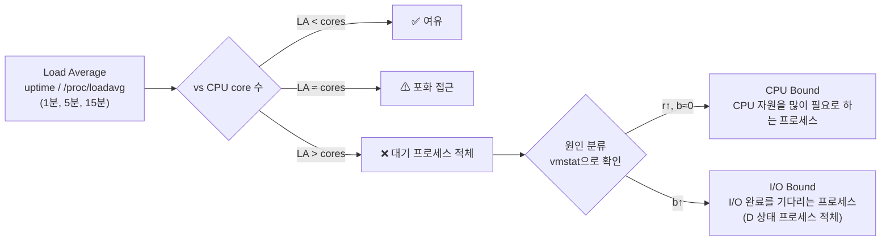
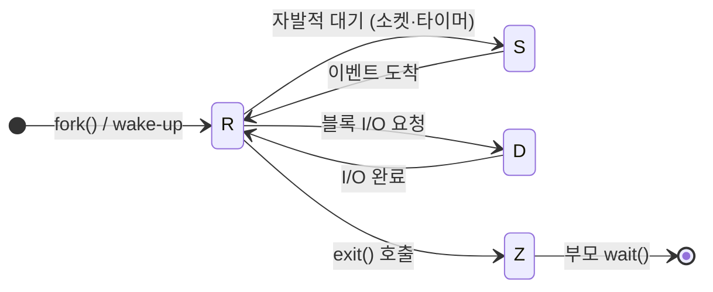

# 리눅스 커널 이야기 — SRE/Cloud Engineer 핵심 요약

> 1~6장 노션 시리즈를 **2개의 테마 보고서**로 재편성.  
> 챕터 순서 대신 "진단/모니터링"과 "메모리 아키텍처 & 튜닝"으로 묶음.

---

# Part 1. 실시간 진단 치트시트

## 1-A. `top` 출력 읽기

```bash
# top -b: batch mode — stdout 출력 (스크립트·파일 리다이렉션에 유용, 키 입력 안 받음)
# top -n 1: 1회만 출력 후 종료 (기본은 무한 반복, 갱신 주기 3초)
```

```
top - 10:46:28 up 5 min,  1 user,  load average: 0.00, 0.00, 0.00
Tasks: 101 total,   1 running, 100 sleeping,   0 stopped,   0 zombie
%Cpu(s):  0.0 us,  0.0 sy,  0.0 ni, 96.8 id,  0.0 wa,  0.0 hi,  0.0 si,  3.2 st
MiB Mem :  916.8 total,  430.6 free,  198.7 used,  287.5 buff/cache
MiB Swap:    0.0 total,    0.0 free,    0.0 used.  586.9 avail Mem
                                                          ↑
                                             여기가 실제 가용 메모리 (free ≠ available)
```

> swap이 헤더 상단에 위치 = swap 사용 여부가 시스템 상태에 중요한 영향을 끼침

**OOM 판단 기준: `avail Mem` (`available`) 컬럼 — `free`가 아닌 `available`로 가용 메모리를 판단해야 함**

---

## 1-B. Load Average 해석 & 부하 원인 분류



> **Load Average = R(Running) + D(Uninterruptible Sleep) 평균**  
> D 상태 프로세스가 많다 → I/O 응답이 오길 기다리는 프로세스 적체

```bash
# 부하 원인 빠르게 분류
vmstat 1
# r = CPU 대기 프로세스 수  (→ CPU Bound)
# b = I/O 대기 프로세스 수  (→ I/O Bound)
```

---

## 1-C. 프로세스 상태 — 알아야 할 3가지



| 상태 | 의미 | SRE 포인트 |
|------|------|-----------|
| **D** (Uninterruptible) | I/O 완료 대기 중 | `kill -9` 불가 ⚠ · Load Average에 포함됨 |
| **S** (Sleeping) | 이벤트 대기 (소켓·타이머) | `kill -9` 즉시 종료 가능 |
| **Z** (Zombie) | 종료됐지만 부모가 미회수 | CPU·메모리 무소비. PID만 점유 → 대량이면 `pid_max` 고갈 위험 |

**Zombie 해결**

```bash
# 부모에게 SIGCHLD 전송 → 부모가 wait() 호출하도록 유도
kill -SIGCHLD <부모_PID>
# 그래도 안 되면 부모 종료 → init이 좀비 회수
kill -9 <부모_PID>
```

---

## 1-D. 프로세스 우선순위 (PR / NI)

```
PR = 20 + NI      (범위 0~39, 낮을수록 우선)
NI 범위: -20 ~ +19
rt 프로세스: 일반 CFS 스케줄러보다 항상 먼저 실행 (커널 데몬 등)
```

```bash
nice -n 10 ./batch-job          # 낮은 우선순위로 시작
renice -n -5 -p <PID>           # 실행 중 변경 (우선순위 올리기는 root 필요)
```

---

## 1-E. 시스템 인프라 확인 명령어 (1장 요약)

```bash
uname -r                          # 커널 버전
lscpu                             # 소켓/코어/스레드/NUMA 구조
ip link                           # NIC 인터페이스 확인
ethtool <iface>                   # 링크 속도, 연결 상태
ethtool -g <iface>                # Ring Buffer 크기 (RX current < max 면 늘릴 것)
df -h                             # 디스크 마운트 현황
cat /boot/config-$(uname -r) | grep CONFIG_FUNCTION_TRACER  # 커널 컴파일 옵션
```

> **Ring Buffer 팁**: `ethtool -g` 에서 Current RX < Pre-set Maximum 이면  
> `ethtool -G <iface> rx <max>` 로 최대치로 설정 → 패킷 드랍 방지

---

# Part 2. 메모리 아키텍처 & SRE 대응 가이드

## 2-A. 메모리 계층 구조 한눈에

```
물리 메모리 (MemTotal)
├── used
│   ├── 프로세스 메모리 (RES = RSan + RSfd + RSsh)
│   │   ├── Active(anon)    ← 힙·스택·malloc, 최근 사용
│   │   └── Inactive(anon)  ← 오래된 프로세스 메모리, swap out 1순위 ⚠
│   └── Slab (커널 내부 자료구조)
│       ├── SUnreclaim      ← 해제 불가 (used에 포함)
│       └── SReclaimable    ← 회수 가능 (buff/cache에 포함)
├── buff/cache
│   ├── Page Cache (파일 내용)
│   │   ├── Active(file)    ← 최근 접근, 보호됨
│   │   └── Inactive(file)  ← reclaim 1순위 ✅ available 계산에 포함
│   └── Buffer Cache (FS 메타데이터 · inode · dentry)
└── free (진짜 빈 공간)

available ≈ free + 회수가능 buff/cache + SReclaimable − 최소 워터마크 여분
```

> **⚠ SRE 핵심 규칙**: OOM 위험 판단은 `free`가 아니라 **`available`** 로

---

## 2-B. VIRT / RES / SHR 이해 (`top` 프로세스 컬럼)

| 컬럼 | 의미 | SRE 관점 |
|------|------|---------|
| **VIRT** | 가상 주소 공간 총합 (물리 미할당 포함) | 커도 문제 없음. 메모리 commit 상태 |
| **RES** | 실제 물리 RAM 점유량 | 높은 프로세스 = 메모리 점유 주범 |
| **SHR** | 다른 프로세스와 공유 (glibc 등) | RES에서 SHR 빼면 단독 사용량 |

```bash
# 메모리 커밋 비율 확인 (over-commit 상태 점검)
grep -E "CommitLimit|Committed_AS" /proc/meminfo
# Committed_AS > CommitLimit → 순간 부하 시 OOM 위험
```

---

## 2-C. 메모리 압박 진단 플로우

```mermaid
flowchart TD
    START["메모리 이슈 감지\n응답 지연 / OOM 로그 / swap 사용"] --> A

    A["free -m 확인"] --> B{available 충분?}
    B -->|"Yes"| B1["used 높아 보여도 안전\nSReclaimable 비중 확인\nslabtop -o"]
    B -->|"No"| C

    C["Swap 사용 여부"] --> D{Swap used > 0?}
    D -->|"No"| E["OOM 임박\n/proc/meminfo 상세 분석"]
    D -->|"Yes"| F["성능 저하 진행 중\n어떤 프로세스가 swap 사용?"]

    F --> G["smem -t 로 프로세스별 Swap 확인\n또는 /proc/<PID>/status → VmSwap"]

    E --> H{Inactive(anon) 큰가?}
    H -->|"Yes"| H1["프로세스 메모리 누수 의심\npmap -x <PID>\ngdb 메모리 덤프"]
    H -->|"No"| H2["Inactive(file) 점검\nPage Cache 압박\ndrop_caches 임시 처방 가능"]

    G --> I["대상 프로세스 특정\n→ 재시작 / cgroup memory.limit 설정\n→ 메모리 누수면 gdb 덤프 분석"]
```

---

## 2-D. 메모리 회수 메커니즘 & 워터마크

```
free 메모리
│ 100%
│  ✅ 여유 구간
│──────── WMARK_HIGH ← kswapd 잠듦
│  ⚠ 경고 구간
│──────── WMARK_LOW  ← kswapd 깨어남 (비동기 회수 시작)
│  ❌ 위험 구간
│──────── WMARK_MIN  ← direct reclaim (요청 프로세스가 직접 회수 → 응답 지연!)
│  💀 고갈
│   0%   → OOM Killer 발동
```

> **`direct reclaim`이 발생하면 메모리 할당 요청한 프로세스가 blocking** → 응답 지연

---

## 2-E. 커널 파라미터 튜닝 가이드

| 파라미터 | 기본값 | 의미 | 노션 기준 가이드 |
|----------|--------|------|----------------|
| `vm.swappiness` | 60 | 높을수록 anon 메모리를 swap으로 적극 이동 | DB·latency 민감: **10**<br>파일 캐시가 중요한 파일 서버: **80~100** |
| `vm.vfs_cache_pressure` | 100 | 높을수록 dentry/inode 캐시 빠르게 회수 | `<100`: 캐시 오래 유지<br>`>100`: 빠르게 회수 (성능 저하 가능)<br>**0 설정 절대 금지** (메모리 고갈) |
| `vm.overcommit_memory` | 0 | 0=heuristic, 1=항상허용(OOM Killer 위험↑), 2=CommitLimit 초과 거부 | 기본값 0 유지 |
| `vm.zone_reclaim_mode` | 0 | 1이면 원격 NUMA 접근 전 로컬 reclaim 시도 (page cache 손실 위험) | DB·Redis·K8s 워커: **0** 유지 |
| `vm.min_free_kbytes` | 자동 | WMARK_MIN 결정 기준 (`/proc/zoneinfo`에서 확인) | — |

```bash
sysctl vm.swappiness vm.vfs_cache_pressure vm.overcommit_memory vm.zone_reclaim_mode
sysctl -w vm.swappiness=10
echo 'vm.swappiness=10' >> /etc/sysctl.conf && sysctl -p
```

---

## 2-F. Slab 메모리 — Case Study 포인트

**실제 사고**: 운영 서버 메모리 사용량이 선형 증가 → 프로세스 합계 10GB, `used` 35~40GB  
**원인**: `dentry cache` 26GB 점유 (crontab 스크립트 버그 → `nss-softokn` 라이브러리 leak)

```bash
slabtop -o | head -20            # Slab 상위 캐시 확인
# 임시 해소 (서비스 영향 있으므로 주의)
echo 2 > /proc/sys/vm/drop_caches   # pagecache + slab 해제
# 근본 원인 찾기: slabtop 로그를 주기적으로 수집해 증가 패턴 파악
```

---

## 2-G. NUMA 아키텍처 & 클라우드 적용

```
UMA (기존)                         NUMA (현대 멀티소켓 서버)
┌─────────────────────────┐        ┌──────────────┐    ┌──────────────┐
│ CPU0 CPU1 CPU2 CPU3     │        │ Node 0       │    │ Node 1       │
│   ↓    ↓    ↓    ↓      │        │ CPU 0-N      │◄──►│ CPU M-Z      │
│ ══════════════ (공유버스) │        │ Local Mem    │    │ Local Mem    │
│         ↓               │        │ (로컬 접근)  │    │ (로컬 접근)  │
│      Memory             │        └──────────────┘    └──────────────┘
└─────────────────────────┘          원격 Node 접근 시 상대적으로 높은 레이턴시 ⚠
  CPU 증가 → 버스 병목 ⚠
```

**클라우드에서 NUMA 튜닝이 의미 있는 시점**

| EC2 인스턴스 | NUMA Node | 튜닝 의미 |
|-------------|-----------|---------|
| t3.xlarge 이하 | 1개 (단일) | ❌ 튜닝 불필요 |
| c5.18xlarge, m5.24xlarge+ | 2개+ | ✅ 튜닝 효과 있음 |
| K8s Guaranteed Pod | kubelet이 관리 | Topology Manager 설정 |

**NUMA 메모리 정책 선택 기준**

```
프로세스 메모리 / Node 메모리 비율 기준:

~30%      → --cpunodebind + --membind   (완전 로컬 고정, 최고 성능)
30~100%   → --preferred                (graceful fallback, OOM 없음)
~150%     → --cpunodebind              (로컬 64% 보장)
150~200%  → cpunodebind 또는 interleave (접근 패턴에 따라)
200%+     → --interleave=all           (버스 부하 균등 분산)
```

```bash
numactl --hardware                     # Node 구성 확인
numastat                               # hit/miss 통계 (numa_miss↑ → 원격 접근 많음)
numastat -p <PID>                      # 특정 프로세스 Node 분포
# K8s
# kubelet: topologyManagerPolicy: single-numa-node
```

---

## 2-H. 메모리 측정 지표 비교 (smem)

| 지표 | 설명 | 공유 메모리 계산 | 언제 쓰나 |
|------|------|----------------|---------|
| **RSS** | RAM 총 점유량 | 전부 포함 (중복 O) | 빠른 현황 파악 |
| **PSS** | 지분 비례 기여량 | 프로세스 수로 나눔 | 시스템 전체 메모리 분석 |
| **USS** | 단독 사용량만 | 제외 | **OOM 분석** (프로세스 죽이면 얼마 확보되나) |

```bash
smem -t    # 프로세스별 Swap, USS, PSS, RSS 확인
```

---

## 진단 명령어 빠른 참조

```bash
# ── 시스템 전반 ──────────────────────────────────────────
top -b -n 1                          # 순간 스냅샷 (stdout 출력)
vmstat 1                             # r(CPU대기) b(IO대기) wa(IO%) si/so(swap)
uptime                               # Load Average 3개 값

# ── 메모리 상세 ──────────────────────────────────────────
free -m                              # available 컬럼이 핵심
grep -E "MemAvailable|Committed_AS|CommitLimit|SwapCached" /proc/meminfo
slabtop -o | head -20                # Slab 상위 캐시 (메모리 누수 진단)
grep -E "min|low|high" /proc/zoneinfo # 워터마크 수치 확인

# ── 프로세스별 메모리 ────────────────────────────────────
smem -t                              # 프로세스별 Swap, USS, PSS, RSS 확인
cat /proc/<PID>/status | grep -i vm  # VIRT/RES/Swap 확인
cat /proc/<PID>/smaps | grep -i swap # 해당 프로세스 swap 사용 상세

# ── NUMA ─────────────────────────────────────────────────
numactl --hardware                   # 물리 Node 구성
numastat                             # Node별 hit/miss 통계
cat /proc/<PID>/numa_maps            # 프로세스 할당 정책

# ── 인프라 정보 (1장) ────────────────────────────────────
uname -r                             # 커널 버전
lscpu                                # CPU 소켓/코어/스레드/NUMA 구조
ethtool <iface>                      # NIC 상태
ethtool -g <iface>                   # Ring Buffer 크기 확인
cat /proc/buddyinfo                  # 메모리 단편화 (버디 시스템 현황)
```
