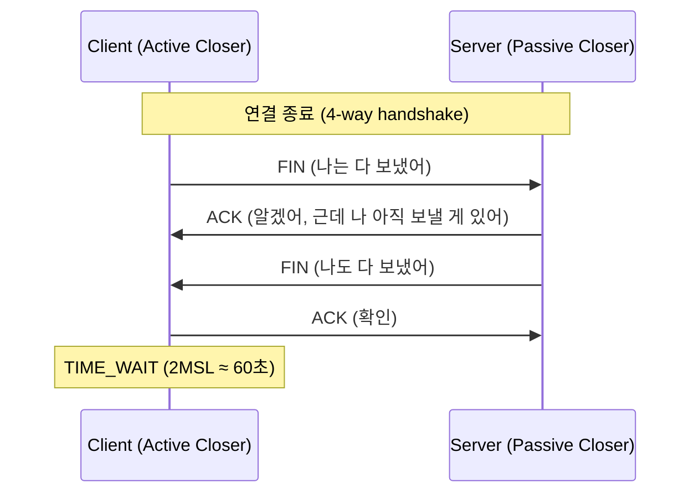
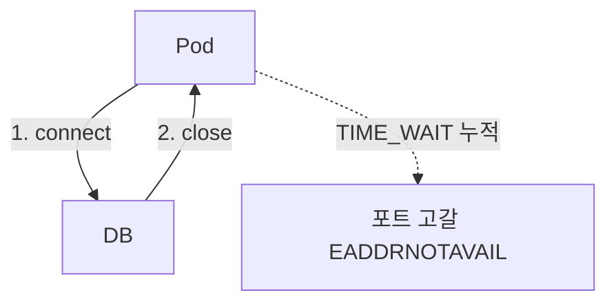
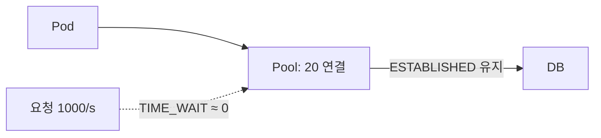
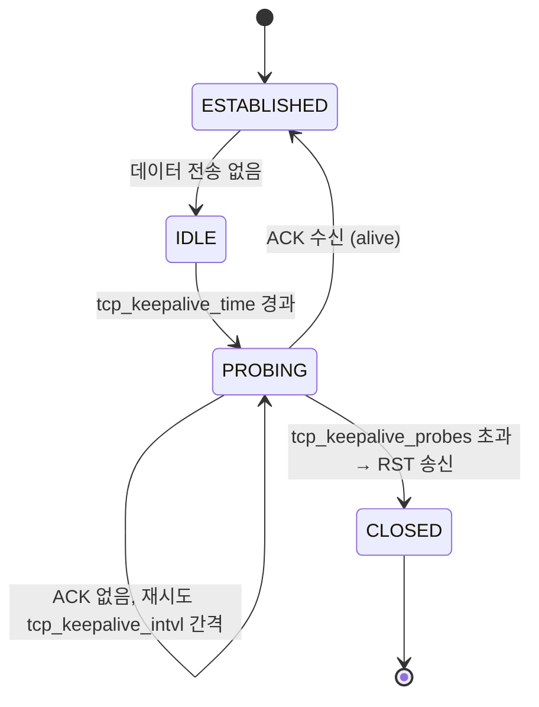
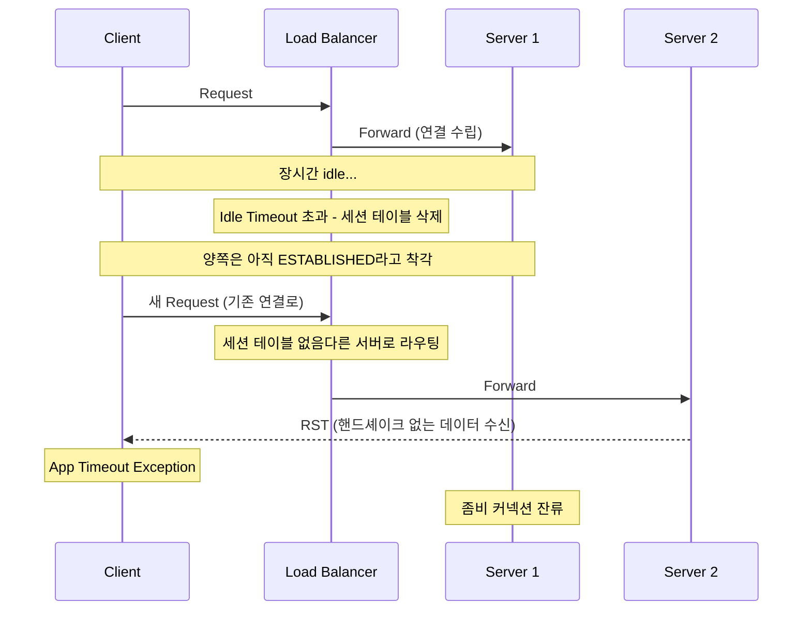
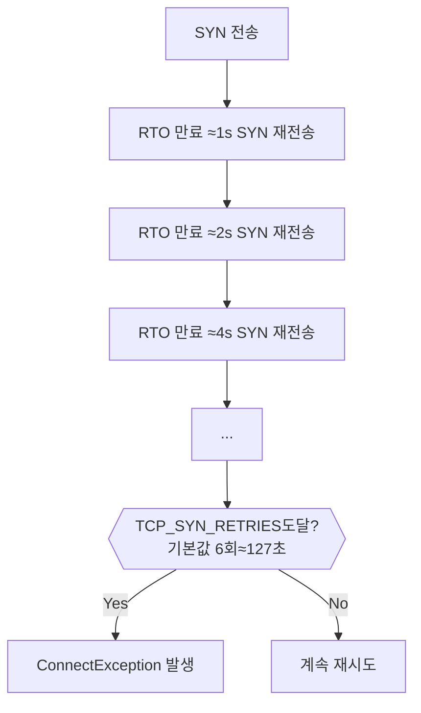
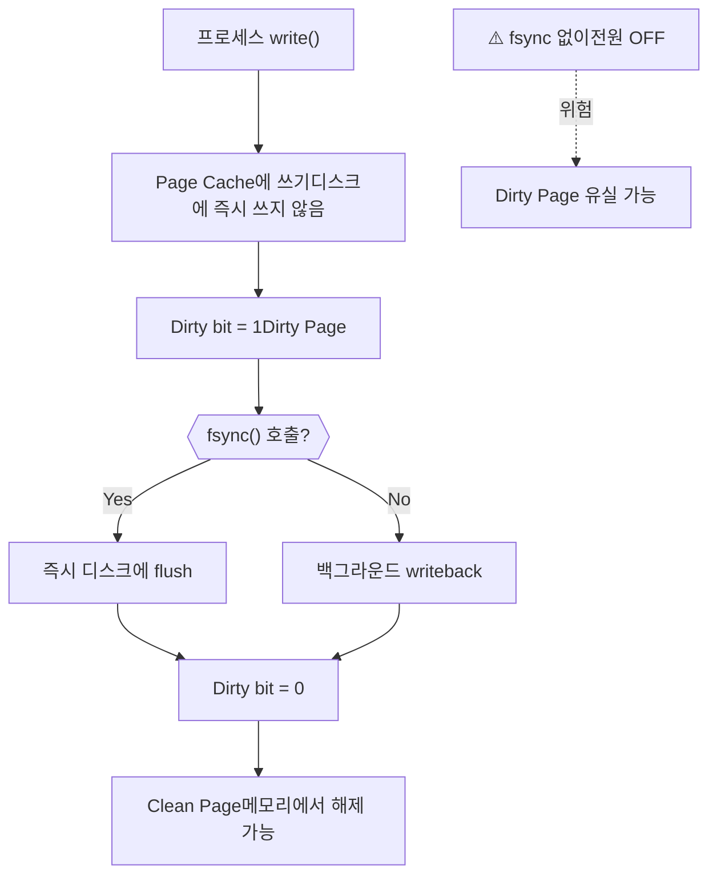
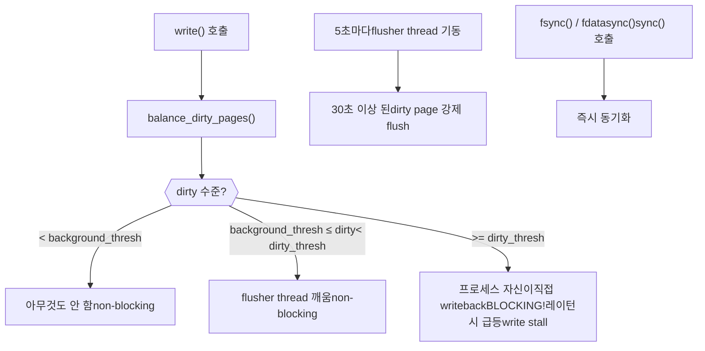
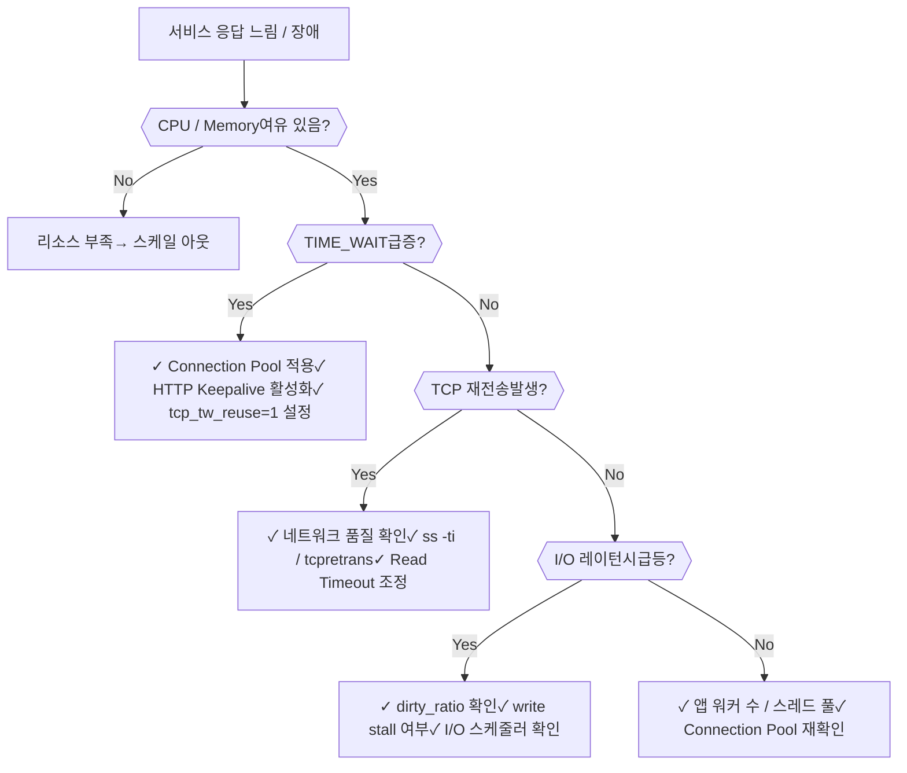

# 리눅스 커널 이야기 — SRE/Cloud Engineer 요약

> 7~12장 기반. 운영 환경에서 직접 마주치는 현상 위주로 개념을 묶어 정리.

---

## 목차

1. [TCP 연결 생명주기와 TIME_WAIT](#1-tcp-연결-생명주기와-time_wait)
2. [TCP Keepalive와 좀비 커넥션](#2-tcp-keepalive와-좀비-커넥션)
3. [TCP 재전송과 타임아웃 설계](#3-tcp-재전송과-타임아웃-설계)
4. [Dirty Page와 I/O 동기화](#4-dirty-page와-io-동기화)
5. [I/O 스케줄러](#5-io-스케줄러)
6. [애플리케이션 성능 튜닝 실전](#6-애플리케이션-성능-튜닝-실전)

---

## 1. TCP 연결 생명주기와 TIME_WAIT

### 연결 수립과 종료

TCP는 연결을 맺을 때 3-way handshake, 끊을 때 4-way handshake를 사용한다.  
끊을 때 **먼저 FIN을 보내는 쪽(Active Closer)** 에 TIME_WAIT가 발생한다.



**Active Closer가 서버가 되는 경우 (SRE 주의):**
- Pod graceful shutdown
- Ingress의 Keep-Alive timeout 만료
- `Connection: close` 헤더 응답 시

### TIME_WAIT 존재 이유

TIME_WAIT가 없으면 마지막 ACK가 유실됐을 때 클라이언트의 재전송 FIN을 서버가 RST로 응답해버린다.  
→ 클라이언트 쪽 `LAST_ACK` 소켓이 누적될 수 있음.

2MSL 동안 유지하는 이유: **네트워크에 떠돌던 이전 연결의 지연 패킷이 새 연결에 잘못 수신되는 것을 방지.**

### TIME_WAIT의 실제 문제

| 문제 | 증상 | 주요 환경 |
|---|---|---|
| Ephemeral Port 고갈 | `connect: Cannot assign requested address (EADDRNOTAVAIL)` | 클라이언트, Ingress→Pod |
| File Descriptor 소모 | `too many open files` | 모든 환경 |
| SNAT 포트 소진 | 노드 단위 포트 고갈 | kube-proxy SNAT, AKS |

```bash
# 현재 TIME_WAIT 수 확인
ss -s | grep timewait

# 포트 범위 확인 (기본 ~28,000개)
cat /proc/sys/net/ipv4/ip_local_port_range
# 32768 60999
```

### 해결책: tcp_tw_reuse

`tcp_tw_reuse=1`은 **클라이언트(outgoing 연결)** 에서만 효과 있다.  
서버 측 TIME_WAIT 누적은 Keepalive 또는 Connection Pool로 해결해야 한다.

```bash
# 권장 설정
net.ipv4.tcp_tw_reuse = 1          # TIME_WAIT 포트 재사용
net.ipv4.ip_local_port_range = 1024 65535  # 포트 범위 확장

# ❌ 절대 금지 — NAT 환경 패킷 드롭, Linux 4.12에서 제거됨
# net.ipv4.tcp_tw_recycle = 1
```

**동작 조건:**
1. `tcp_tw_reuse >= 1`
2. `tcp_timestamps = 1` (양쪽 모두)
3. TIME_WAIT 진입 후 1초 이상 경과
4. outgoing connection(`connect()` 호출)일 때만

**NAT 뒤에서 `tcp_tw_recycle`이 위험한 이유:** 서버가 per-host timestamp 기반으로 패킷을 드롭한다. NAT 뒤의 여러 클라이언트는 타임스탬프 클락이 제각각이므로 정상 패킷이 버려진다. `tcp_tw_reuse`는 클라이언트 측 동작이므로 이 문제가 없다.

### Connection Pool vs Connection per Request

**Connection per Request (❌ 나쁨)**


**Connection Pool (✅ 권장)**


| | Connection per Request | Connection Pool |
|---|---|---|
| TCP 연결 수명 | 요청 1개 | 애플리케이션 수명 |
| TIME_WAIT 발생 | 요청마다 누적 | 거의 발생 안 함 |
| Handshake 오버헤드 | 매 요청마다 | 초기 1회만 |

**Envoy/Istio 사이드카, PgBouncer가 TIME_WAIT 문제를 완화하는 이유:** 내부적으로 connection pooling을 수행해서 upstream으로의 4-way handshake 횟수 자체를 줄여버린다.

### Kubernetes Pod 레벨 sysctl 적용

```yaml
apiVersion: v1
kind: Pod
spec:
  securityContext:
    sysctls:
      - name: net.ipv4.tcp_tw_reuse
        value: "1"
      - name: net.ipv4.ip_local_port_range
        value: "1024 65535"
```

---

## 2. TCP Keepalive와 좀비 커넥션

### TCP Keepalive란

연결이 idle 상태일 때 OS 커널이 주기적으로 작은 probe 패킷을 보내 상대가 살아있는지 확인하는 기능.  
패킷 크기는 ~68 bytes로 매우 작다.



### 핵심 파라미터

```bash
sysctl -a | grep -i keepalive
# net.ipv4.tcp_keepalive_time  = 7200   # idle 후 probe 시작까지 대기 시간 (초)
# net.ipv4.tcp_keepalive_intvl = 75     # probe 재시도 간격 (초)
# net.ipv4.tcp_keepalive_probes = 9     # 최대 재시도 횟수

# 현재 소켓 keepalive 타이머 확인
netstat -napo | grep keepalive
```

### 좀비 커넥션 (Zombie Connection)

**"이미 죽었는데 시스템은 살아있다고 착각하는 TCP 연결"**

발생 원인:
- 클라이언트가 FIN 없이 조용히 죽는 경우 (앱 크래시, 모바일 백그라운드 종료)
- 중간 네트워크 장비(NAT, 방화벽)가 연결을 몰래 끊는 경우
- 서버 전원 OFF / 크래시

문제:
- 소켓·메모리·FD 점유
- 서버가 응답을 보내도 아무도 못 받음 → `ESTABLISHED` 상태로 방치

TCP Keepalive를 쓰면 일정 시간 후 probe에 응답이 없으면 커널이 RST를 보내고 소켓을 정리한다.

```bash
# 운영에서 좀비 커넥션 찾기
# ESTABLISHED인데 Recv-Q/Send-Q가 오랫동안 0이 아닌 것
ss -tn state established | awk '$2 != "0" || $3 != "0"'
```

### TCP Keepalive vs HTTP Keepalive

| 구분 | TCP Keepalive | HTTP Keepalive |
|---|---|---|
| 계층 | 전송 계층 (OS 커널) | 애플리케이션 계층 |
| 목적 | 죽은 연결 감지 + 연결 유지 | 연결 재사용 (성능) |
| 동작 주체 | OS 커널 | 웹 서버 / 클라이언트 |
| 언제 중요 | WebSocket, DB 연결, 장기 연결 | API 서버, 요청 많은 서비스 |

**HTTP keepalive > TCP keepalive 타임아웃인 경우:** HTTP keepalive에 의해 서버가 먼저 연결을 종료한다.

### 실전 사례: 로드밸런서 Idle Timeout



**해결:** TCP keepalive의 `time + intvl × probes`가 LB의 Idle Timeout보다 짧아야 한다.

```bash
# 예: LB idle timeout = 120s
net.ipv4.tcp_keepalive_time   = 10
net.ipv4.tcp_keepalive_intvl  = 60
net.ipv4.tcp_keepalive_probes = 3
# → 최대 10 + 60×3 = 190s. 패킷 유실 고려해도 120s 내 충분히 감지
```

---

## 3. TCP 재전송과 타임아웃 설계

### RTT와 RTO

- **RTT (Round Trip Time):** 패킷이 왕복하는 실측 시간. 단일 샘플이 아니라 SRTT(지수이동평균) + RTTVAR(분산)으로 평활화.
- **RTO (Retransmission Timeout):** ACK가 이 시간 내에 안 오면 재전송. `RTO = SRTT + max(G, 4 × RTTVAR)`

TCP 재전송은 **애플리케이션에 투명(transparent)** 하다. 커널이 조용히 처리하며, 앱이 영향받는 시점은 **재전송 누적 시간이 앱 레벨 타임아웃을 초과했을 때**뿐이다.

### 재전송 관련 커널 파라미터

| 파라미터 | 기본값 | 설명 |
|---|---|---|
| `tcp_syn_retries` | 6 | SYN 재전송 최대 횟수 (기본값이면 최대 ~127초) |
| `tcp_synack_retries` | 5 | SYN-ACK 재전송 최대 횟수 (~63초간 half-open 유지) |
| `tcp_retries1` | 3 | ESTABLISHED 재전송 중 경로 재탐색 임계값 (soft) |
| `tcp_retries2` | 15 | ESTABLISHED 재전송 포기 임계값 (~13~15분) |
| `tcp_orphan_retries` | 0(=8) | FIN_WAIT1 고아 소켓 FIN 재전송 횟수 |

> **SRE 핵심:** `tcp_retries2` 기본값이 15분이므로, 앱의 Read Timeout은 반드시 이보다 짧아야 스레드가 무한 블로킹되지 않는다.

### 고아 소켓 (Orphan Socket)

앱이 `close()`를 호출하면 FD는 사라지지만 커널 소켓은 FIN-ACK를 기다리며 살아 있는다.  
`tcp_max_orphans`(기본 16384) 초과 시 커널이 즉시 소켓을 파괴하고 경고 로그를 남긴다.

```bash
# 고아 소켓 현황
cat /proc/net/sockstat | grep TCP
# TCP: inuse 3 orphan 0 tw 1 alloc 4 mem 0

# FIN_WAIT1 소켓 수
ss -tan state fin-wait-1 | wc -l
```

### ss 명령어로 TCP 상태 진단

```bash
ss -tinp          # TCP 상세 + 내부 타이머/RTO + PID
ss -ti dst 10.0.0.5  # 특정 목적지 연결만 상세 보기
```

출력 해석:
- `rto:210` — 현재 RTO 값(ms). Linux 최소 RTO(`tcp_rto_min`) 기본 200ms
- `rtt:3.75/1.5` — SRTT / RTTVAR (ms)
- `retrans:0/2` — 현재 재전송 중 / 누적 재전송 횟수. **이 값이 꾸준히 증가하면 네트워크 품질 문제 신호**

### 특정 경로에만 RTO_MIN 적용

```bash
# sysctl은 전역값이지만 ip route로 경로별 적용 가능
ip route change 10.0.0.0/8 via 10.0.0.1 rto_min 20ms

# 적용 확인
ss -ti dst 10.0.2.10 | grep rto
```

### 애플리케이션 타임아웃 설계 원칙



| 타임아웃 종류 | 의미 | 권장값 |
|---|---|---|
| Connection Timeout | 3-way handshake 완료까지 대기 | 0.5~3s |
| Read Timeout | 응답 데이터 수신까지 대기 | 1~5s (내부 서비스) |

**tail latency 주의:** 99%의 요청은 정상이지만 재전송이 발생하는 1%의 요청만 수백ms~수초 지연이 생겨 P99 레이턴시를 끌어올린다.

**retry storm:** 재전송 지연으로 스레드 풀이 가득 찬 상황에서 앱이 자체 재시도까지 하면, 이미 혼잡한 네트워크에 트래픽을 더 얹는 결과가 된다.

---

## 4. Dirty Page와 I/O 동기화

### Dirty Page란



- `write()`가 반환돼도 실제 디스크 I/O는 발생하지 않는다 — Write-Back 캐싱
- `fsync()` 없이 전원이 꺼지면 Dirty Page는 유실 가능
- Dirty Page는 디스크에 flush하기 전까지 메모리에서 해제 불가 → **메모리 압박 시 위험**

### Dirty Page 관련 커널 파라미터

| 파라미터 | 기본값 | 설명 |
|---|---|---|
| `vm.dirty_background_ratio` | 10% | 이 비율 초과 시 **백그라운드** writeback 시작 (non-blocking) |
| `vm.dirty_ratio` | 20% | 이 비율 초과 시 **write() 자체를 blocking** (write stall!) |
| `vm.dirty_expire_centisecs` | 3000 (30초) | dirty 상태로 이 시간 초과 시 강제 writeback |
| `vm.dirty_writeback_centisecs` | 500 (5초) | flusher thread가 깨어나는 주기 |
| `vm.dirty_background_bytes` | 0 | `dirty_background_ratio`와 동일 역할, 절댓값 지정 |
| `vm.dirty_bytes` | 0 | `dirty_ratio`와 동일 역할, 절댓값 지정 |

> `_ratio`와 `_bytes`를 동시에 설정하면 **나중 설정값이 다른 쪽을 0으로 초기화**한다. 반드시 둘 중 하나만 사용.

### Writeback 트리거 조건



### write stall 이란

`vm.dirty_ratio`에 도달하면 `write()`를 호출한 프로세스 자신이 직접 writeback을 수행하면서 sleep까지 걸린다. 이를 **write stall**이라 한다.  
Kubernetes 환경에서는 **한 Pod의 대량 write가 같은 Node의 다른 Pod write()까지 blocking**시키는 영향이 생긴다.

### 워크로드별 튜닝 전략

**① 저지연 우선 — DB, 실시간 처리**
```bash
vm.dirty_writeback_centisecs = 100   # 자주 깨움 (1초)
vm.dirty_background_ratio    = 5     # 소량 유지
vm.dirty_expire_centisecs    = 500   # 빠르게 expire
vm.dirty_ratio               = 10    # write stall 임계값 낮게
```

**② 처리량 우선 — 대용량 로그, 배치, 스트리밍**
```bash
vm.dirty_writeback_centisecs = 1500  # 드물게 깨움
vm.dirty_background_ratio    = 20    # 대량 허용
vm.dirty_expire_centisecs    = 6000  # 오래 보관
vm.dirty_ratio               = 40    # write stall 여유 확보
# ⚠️ flush storm 발생 시 레이턴시 수초~수십초 급등 위험
```

**③ 대용량 메모리 서버 (128GB 이상) — ratio 대신 bytes 고정**
```bash
vm.dirty_background_bytes = 536870912  # 512MB
vm.dirty_bytes            = 1073741824 # 1GB
# ratio 방식: 128GB × 10% = 12.8GB가 쌓일 수 있어 flush storm 위험
```

### 명시적 동기화 API

| 시스템 콜 | 대상 | 특징 |
|---|---|---|
| `fsync(fd)` | 특정 파일 | 데이터 + 메타데이터, 완료까지 block |
| `fdatasync(fd)` | 특정 파일 | 데이터만, fsync보다 빠름 |
| `sync()` | 시스템 전체 | 완료 보장 안 함 (비동기) |
| `msync()` | mmap 영역 | memory-mapped 파일 반영 |

DB(MySQL, PostgreSQL)가 `fsync()`를 필수로 호출하는 이유: 커널의 자동 writeback은 타이밍을 보장하지 않으므로 트랜잭션 커밋 시점에 반드시 명시적 동기화가 필요하다.

---

## 5. I/O 스케줄러

### 역할과 필요성

애플리케이션의 `read()`/`write()` → **블록 레이어 스케줄러 큐** → 디스크

주요 역할:
- **Merging:** 인접한 섹터 요청을 하나로 합침
- **Sorting (Elevator):** 디스크 헤드 이동 거리 최소화 (HDD 전용)
- **Fairness:** 프로세스/cgroup 간 I/O 대역폭 분배

### 디스크 종류와 스케줄러 선택

| 구분 | HDD | SSD (SATA) | NVMe SSD |
|---|---|---|---|
| Seek time | 수 ms (물리적 이동) | ≈ 0 | ≈ 0 |
| 랜덤 IOPS | 100~200 | 수만 | 수십만~백만 |
| 병렬 큐 | 단일 | NCQ 32 | 최대 64K×64K |
| 정렬 효과 | 매우 큼 | 작음 | 거의 없음 |

→ **SSD/NVMe에서는 sorting이 의미 없다.** 스케줄러 오버헤드만 생긴다.

```bash
# 현재 스케줄러 확인
cat /sys/block/nvme0n1/queue/scheduler
# [none] mq-deadline kyber bfq

# 스케줄러 변경
echo bfq > /sys/block/sda/queue/scheduler
```

### 스케줄러 비교

**I/O 스케줄러 비교**

**CFQ (Completely Fair Queuing)**
- 프로세스별 독립 큐 + 타임 슬라이스
- ionice 클래스: RT(Realtime) > BE(Best-Effort) > IDLE
- Linux 5.4에서 제거됨 → BFQ로 대체

**Deadline / mq-deadline**
- 모든 요청에 만료 시각 부여
- FIFO queue + Sorted queue 이중 구조
- Starvation 방지가 핵심

**Noop / none**
- 병합(merge)만 수행
- FIFO 순서 유지
- SSD/NVMe 전용, 오버헤드 최소

| 스케줄러 | 특징 | 적합한 워크로드 |
|---|---|---|
| CFQ/BFQ | 프로세스 공평 분배, 타임 슬라이스 | HDD, 동영상 스트리밍/인코딩 |
| Deadline/mq-deadline | 요청 만료 시각 보장, starvation 방지 | HDD DB 서버, 파일 서버 |
| Noop/none | 병합만, 오버헤드 없음 | SSD, NVMe, 가상머신 |

### Deadline 스케줄러 핵심 파라미터

```bash
# /sys/block/<dev>/queue/iosched/
read_expire    = 500ms    # read 요청 deadline (프로세스 블로킹 중이므로 짧게)
write_expire   = 5000ms   # write 요청 deadline (페이지캐시 writeback이라 느슨하게)
writes_starved = 2        # read 2회 처리 후 write 1회 처리
fifo_batch     = 16       # deadline 만료 시 한 번에 처리할 최대 요청 수
```

### I/O 모니터링

```bash
# 프로세스별 I/O 사용량 실시간 모니터링
iotop -P

# 특정 소켓 RTO/RTT 상세
ss -ti

# TCP 재전송 실시간 추적 (BCC 툴)
/usr/share/bcc/tools/tcpretrans
```

---

## 6. 애플리케이션 성능 튜닝 실전

> Flask + Redis + nginx 스택으로 단계별 튜닝 실험 결과

### 성능 개선 흐름


### 핵심 교훈 정리

#### ① CPU 효율 — 멀티 프로세스

```bash
# gunicorn worker 수 = (CPU 코어 수 × 2) + 1 권장
gunicorn -w 5 -b 0.0.0.0:5000 app:app
```

- 단일 코어에서는 멀티 프로세스 효과 없음 (컨텍스트 스위칭 오버헤드만 증가)
- K8s: Pod의 `requests.cpu` 기준으로 worker 수 결정. `cpu limit` 초과 시 Throttling 발생

#### ② TIME_WAIT = "연결을 매번 끊고 있다"는 신호

TIME_WAIT 소켓 수는 연결 맺고 끊음의 빈도를 그대로 반영한다. 어디서 발생하는지 찾아서 Connection Pool 또는 Keepalive로 해결한다.

```bash
# TIME_WAIT 발생 위치 확인
ss -tn state time-wait | awk '{print $4, $5}' | sort | uniq -c | sort -rn | head
```

#### ③ nginx ↔ upstream 구간 keepalive

```nginx
upstream backend {
    server 127.0.0.1:5000;
    keepalive 32;  # upstream으로의 연결 유지
}

server {
    location / {
        proxy_http_version 1.1;
        proxy_set_header Connection "";  # keepalive 사용 시 Connection 헤더 제거 필수
        proxy_pass http://backend;
    }
}
```

#### ④ epoll — 대규모 연결 처리

| 방식 | 탐색 방법 | 복잡도 |
|---|---|---|
| select/poll | 모든 FD 순회 | O(n) |
| **epoll** | 이벤트 발생한 FD만 알림 | **O(1)** |

```nginx
events {
    use epoll;
    worker_connections 1024;
}
```

### Kubernetes / Cloud 환경 체크리스트

| 항목 | 체크 포인트 |
|---|---|
| Connection Pool | Pod → DB/Redis 반드시 pool 사용. HPA로 Pod 증가 시 DB `max_connections` 관리 |
| tcp_tw_reuse | DaemonSet + initContainers로 노드 커널 파라미터 설정 |
| SNAT 포트 고갈 | `tcp_tw_reuse=1`이 노드에 있어도 Azure/AWS SNAT 포트 고갈은 별도 문제 → NAT Gateway 도입 검토 |
| gunicorn workers | Pod CPU limit 기준으로 설정. Throttling 여부는 `container_cpu_cfs_throttled_seconds_total` 메트릭 확인 |
| nginx Ingress | `upstream-keepalive-connections` annotation으로 upstream keepalive 조정 |
| 모니터링 | TIME_WAIT: `system.net.tcp4.time_wait` / 포트 고갈 징후: `system.net.tcp4.opening` 급증 |

### 요약: 서비스 응답이 느리거나 장애가 발생할 때 확인 순서



